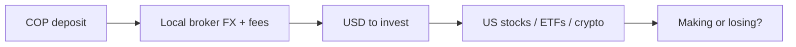

# Fintu

A portfolio tracker that tells you if you are making or losing money after fees and FX.

This is the product memo: why Fintu exists, what a user can do today, and where the product is going. How the repo is wired lives elsewhere.

---

## The problem

Fintu was built for the founder first.

He invests in the US market — stocks, ETFs, and crypto — through a local broker, but he deposits in Colombian pesos. The broker converts that money to USD at its own rate and charges fees along the way.

This problem is not unique to Colombia or to COP. Any investor whose broker sits between their local currency and USD has the same blind spot: you deposit pesos, the broker converts to dollars at their rate (with their markup), charges fees on top, and nobody tells you what that conversion actually cost you. Mexico (MXN), Argentina (ARS), Brazil (BRL), Peru (PEN), Chile (CLP) — the currency changes, the problem does not.

Generic portfolio tools ignore that path. They show a ticker, today's price, and maybe today's USD/COP from the news. They never see the conversion the broker actually used or the fees it actually took, so "am I up or down?" is guesswork. You can look rich in dollars and still have lost purchasing power in pesos, or the reverse, and not know which.

Fintu's job is a simple, deterministic answer: after fees and the broker's conversion, is this money making or losing?

Today only the US market is in scope. Other markets come later. Entry is still manual — you record what happened; Fintu does not pull it from the broker.

---

## Value proposition

What a user gets:

- True performance of US holdings when the money started as pesos
- Fees that are not hidden — they sit in cost and in cash, not in a footnote
- FX at the rate that actually applied on the day, not today’s news rate
- One place for deposits, trades, and “am I winning?”

Fintu is not a broker. It is not a trading app. You already trade elsewhere. Fintu is the ledger that tells the truth.

“True” here means money-weighted return: what you actually earned on the cash you put in, after the costs of getting that cash into the market. The book is in USD. Local currency (COP first) is the funding path, not a second portfolio you have to reconcile by hand.

---

## Who it's for

Retail investors who fund a US brokerage account through a broker that converts their local currency to USD. Colombia and Hapi are the beachhead.

The problem is currency-agnostic: any investor whose broker sits between their pesos (COP, MXN, ARS, BRL, PEN, CLP — or any local currency) and a US account loses money on the FX spread and fees, and nobody tells them how much. Fintu does.

Mexico is modeled so the product is not Colombia-only in principle. You can pick a country and a broker, including other local names besides Hapi. Go-to-market stays Colombia first until that beachhead is real.

---

## What you can do today

Sign in, pick a country and a broker, and keep an honest book of a US portfolio funded in local currency.

- **Dashboard** — net worth, holdings, recent activity. This is the “how am I doing?” screen. Prices update when you click Refresh; they do not yet refresh on their own.
- **Trades** — record buys and sells of US stocks, ETFs, and crypto. Average cost is the holding method today.
- **Cash** — deposits, withdrawals, and fees, plus the FX rates that actually applied when money moved.
- **Performance** — money-weighted return, fee impact, FX impact, and a comparison vs SPY, so you can see whether the book beat a simple US market proxy after costs.

The daily loop is: record cash when you fund or withdraw, record trades when you buy or sell, keep the FX that the broker used, then read the dashboard and performance. Nothing executes a trade. Fintu only accounts for what already happened.

The product is in closed beta. Paid billing is not live; nobody is charged yet. Plans exist as a shape of the product — what Pro might include later — not as a checkout.

The marketing site is separate from the app. The app is the tracker. The site is how people find it.

---

## Roadmap

Launch is not “add payments.” Launch is “people can use it.” Paid plans come after a small beta proves the value.

1. **Get the product online** so people can use it. The app works on a local machine; it is not yet a live product on the internet.
2. **Keep prices fresh automatically.** Today you click Refresh. After the product is online, quotes (including SPY) should update after the US close without a click. Stale prices make “am I winning?” a lie.
3. **Invite a small Colombia / Hapi beta** — on the order of 20–50 people who already live this path. They are the test of whether the ledger is worth opening every week.
4. **Paid plans** once that beta shows the value. In Colombia that means Wompi. Not before going live, and not before the beta has a reason to exist.
5. **Exports** — PDF is promised on Pro and is not built yet. Colombian tax forms come later; they are not the reason to launch.

### Later / not now

- **Auto-import from brokers.** Hapi has no CSV export, so a Hapi importer is cancelled for now. Broader auto-ingest (statements, notifications, screenshots) is a later product, not a launch item.
- **More markets than the US.** The money path is US assets funded locally. Other markets wait.
- **FIFO, multi-broker-as-accounts, Chile.** Average cost and one book per user are enough for the beachhead. Chile and a true multi-account model wait until Colombia / Hapi ships.

Do not reverse these on the way to launch: keep marketing off the app, do not rebuild the cancelled Hapi importer, and do not put checkout in front of a live product and a real beta.

---

## How we got here

This started as a personal tool: track a Hapi account honestly, including the conversion and the fees the broker actually charged.

The idea did not change. The product grew around it. Fees and FX were first-class from the start — because that was the whole point. Then a dashboard and a performance view so “am I winning?” had a home. Then onboarding, broker choice, and a path to charge later, once the book was something other people might use.

Recent work is making it launchable — online, with fresh prices, then a small beta — not inventing a new thesis.

---

## Competitive landscape

The broad "portfolio tracker" category is crowded. That is not the question. The question is whether the specific problem Fintu solves is well served.

### What exists

| Category | Products | Do they solve fees + FX? |
|----------|----------|------------------------|
| Global trackers (advanced) | Sharesight, Capitally, Portseido | Yes — deep FX attribution + fee decomposition. Built for advanced DIY investors. Priced for developed markets. No LATAM focus. |
| Global trackers (general) | Delta, PortfolioTrackr, GuardFolio | Partial — some FX, no fee-specific tracking. |
| Multi-currency dashboards | Curravo, FlashFi, Foliopal | Partial — FX rates, but no fee attribution. Foliopal is closest in spirit ("real FX-adjusted gains, the clarity your broker's app will never give you") but generic, not LATAM. |
| LATAM-specific | Inversoria | Broker imports (Hapi, Trii, XTB, IBKR) + AI stock analysis. No explicit fee/FX attribution. A trading companion, not a truth ledger. |
| Brokers themselves | Hapi, Trii, eToro | Show positions and gross returns. Do not show net-of-fees-and-FX performance. Conflict of interest — they don't want to highlight how much fees eat returns. |

### Where Fintu sits

Fintu is not a general portfolio tracker. It is the **truth ledger for investors whose broker converts their local currency to USD**.

The specific wedge: a retail investor sends pesos (COP, MXN, ARS, BRL, PEN, CLP — any local currency) to a broker that converts to USD at the broker's own rate. The broker takes a spread on the FX and charges fees on top. Nobody tells the investor what that conversion actually cost them, or whether they're actually making money after all of it.

That problem is currency-agnostic. Colombia + Hapi is the beachhead because that's the founder's experience. But the thesis applies to:

- Mexico: MXN → USD via Hapi or eToro
- Argentina: ARS → USD via any broker offering US stocks
- Brazil: BRL → USD via Hapi, eToro, Nuinvest
- Peru/Chile: PEN/CLP → USD via Hapi or eToro
- Anywhere: local currency → USD (or in the future, other currencies)

### What Fintu should NOT compete on

- Advanced analytics (TWR, MWR, IRR, options tracking) — Capitally owns this
- Broker integrations / CSV imports — Inversoria and Sharesight own this
- Tax reporting — Sharesight owns this globally

### What Fintu's moat is

- **The honest answer**: "Am I making or losing money after fees and FX?" in plain language — no XIRR, no "fee drag," no jargon. Nobody does this well.
- **Broker FX awareness**: Understanding that the broker's conversion rate is not the market rate, and quantifying what that gap cost you.
- **Currency-agnostic**: Any local currency → USD (or future currency pairs). Not limited to COP.
- **Plain language**: "You're up $X after fees and FX." Not "Your money-weighted return is Y% with a fee drag of Z%."
- **Speed + focus**: Being the first to nail this specific niche before global tools localize or LATAM tools add depth.

### The real risk

The risk is not that the category is crowded. The risk is distribution — reaching 20–50 paying users who care about fees and FX before either (a) global tools like Capitally localize to Spanish, or (b) LATAM tools like Inversoria add fee attribution, or (c) brokers like Hapi add "true performance after fees" themselves.

The code is mostly built. The remaining work is: ship it, put it in front of Hapi users, and ask "would you pay for this?"

---

## Where to read more

- **docs/TODO.md** — launch checklist (what is still blocking a live product).
- **docs/deploy.md** — how the live product gets onto the internet.
- **CLAUDE.md** — how this repo is built and how agents should work in it.
