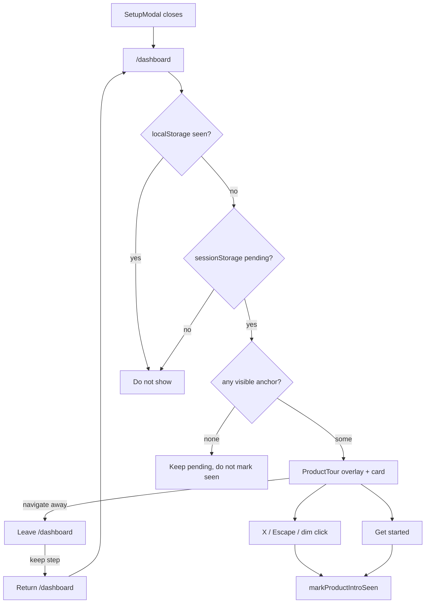

# Product tour — UI spec

Status: **design only**. Alchemist implements `ProductTour` and AppShell wiring. This file does not wire `AppShell`. Do not commit from the design task.

Sequence (locked): `SetupModal` (country / broker, **not dismissible**, unchanged) closes → this tour opens **on `/dashboard` only**, over the live dashboard. English copy in this spec; Spanish in implementation.

This **replaces** the centered 3-slide `ProductIntroModal`. It is a Mixpanel-style spotlight walkthrough: a dim overlay with a hole around one control, and a compact glass card parked next to that control.

This is **not** the auth surface. Do not use `auth-light`, `auth-shell`, `bg-white`, or paper cards from `frontend/app/auth/auth-shell.css`. Do not copy Mixpanel’s white paper tooltip. Translate the **layout** (hole + compact card + pointer + X / Next) into Fintu glass.

---

## Purpose / tone

**Purpose.** After setup, a new user lands on an empty (or loading) dashboard and does not know which control answers “after costs, am I making or losing?” The tour points at four real surfaces, in order: the net-worth question, recording cash, recording trades, then reading Performance. Completing Add Cash / Add Trade is **optional**; the highlighted control stays clickable. Informational advance is Next / Skip / X / Escape.

**Tone.** Ledger glass over a living book — same family as dashboard cards, not a marketing carousel and not a modal lecture. Quiet, precise, skippable. The dashboard is the vignette; the card is only a caption.

**Memorable choice (locked):** a **spotlight cutout** (target undimmed, rest dimmed) plus the **3px primary ledger rail** on the floating card (same rail as the retired intro).

Discovered system (do not replace):

```
Main:       DM Sans (font-sans)
Mono:       JetBrains Mono (font-mono) — kicker `01 / 04` only
Tailwind:   v4 CSS-first
Tokens:     OKLCH via packages/brand/tokens.css
Accent:     spring-green primary (--primary / black canvas)
Dark wired: yes (.dark + glass tokens)
Glass:      elevatedGlassClass (from-white/[0.07] to-card/90, backdrop-blur-[12px], border-white/10)
```

No Inter. No raw hex except existing shadow recipes (`shadow-[0_12px_32px_rgba(0,0,0,0.38)]` already in `elevatedGlassClass`). Mobile-first 375px, then `md+` (768).

---

## Locked product decisions

| Decision | Rule |
|----------|------|
| SetupModal | Unchanged. Blocking. Tour never opens while setup is open. |
| Advance | Next / Skip / X / Escape. No Back. |
| CTAs | Add Cash / Add Trade stay clickable. Completing them is optional. |
| Route | `/dashboard` only. No tour-driven navigation. |
| Overlay | Custom. **No** driver.js / joyride / intro.js / shepherd. |
| Positioning | Reuse `@radix-ui/react-popover` (already in the app). |
| Glass | `elevatedGlassClass` from `frontend/components/ui/elevated-glass.ts`. |
| z-index | Overlay **z-40**. Radix dialog / drawer stay **z-50** and open above the tour. |
| Persistence | New users only. Reuse `fintu:product-intro-seen:{userId}` (localStorage). People who already skipped the old intro **never** see this. |
| Leave dashboard | Keep pending + current step in **sessionStorage**; resume when they return to `/dashboard`. |
| Zero anchors | Do **not** mark seen. |

---

## Four steps

Resolve anchors with `document.querySelector` / `querySelectorAll` on `data-tour`. If the primary node is missing, use the fallback. If that step still has no visible node, **skip the step** (advance internally; do not show an empty card). If **every** step has no visible node, do not render the tour and do **not** mark seen.

| # | `data-tour` | Primary target | Fallback if CTA missing | Copy title | Copy body |
|---|-------------|----------------|-------------------------|------------|-----------|
| 1 | `net-worth` | Dashboard primary-grid **cell** that wraps NetWorthCard **or** NetWorthCardSkeleton | none — skip step | The question | After fees and FX, are you making or losing? |
| 2 | `add-cash` | Activity empty-state **Add Cash Flow** trigger | Visible Cash Flows nav item (`href="/cash-flows"`) still on dashboard | Record cash | Deposits, withdrawals, and the broker's actual FX when money moved. |
| 3 | `add-trade` | Dashboard empty **Add trade** trigger | Visible Trades nav item (`href="/trades"`) still on dashboard | Record trades | Buys and sells. |
| 4 | `nav-performance` | Performance nav — **both** desktop sidebar link **and** mobile bottom-nav item | none — skip step | Then read | Dashboard and Performance answer the question. |

Kicker: `01 / 04` … `04 / 04` using the **display index among remaining placeable steps**, padded to two digits. If a step is skipped for a missing anchor, do not leave a hole in the kicker (e.g. three placeable steps → `01 / 03`). `aria-live="polite"` announces `Step N of M`.

### Where to put `data-tour` (alchemist)

**`net-worth` — on the grid cell, not the inner card.** Survives skeleton and Suspense.

```tsx
// frontend/app/(app)/dashboard/page.tsx  AND  DashboardPageSkeleton matching cell
<div
  className="lg:row-start-1 lg:row-end-2 lg:col-start-1 lg:col-end-2"
  data-tour="net-worth"
>
  {netWorthQuery.isLoading ? <NetWorthCardSkeleton /> : <NetWorthCard ... />}
</div>
```

**`add-cash` — on the Activity empty Add Cash Flow trigger.** In `activity-feed.tsx`, the empty `EmptyStateActions` currently wraps `AddCashFlowDialog`. Put `data-tour="add-cash"` on the trigger `Button` (forward a `data-tour` / `className` through `AddCashFlowDialog` if needed) or on the wrapping `EmptyStateAction` if its box matches the button. Do **not** put it on the whole Activity card.

**`add-trade` — on the dashboard empty Add trade trigger.** In `dashboard-empty-state.tsx`, on the `AddTradeDialog` trigger (the control that currently renders `dashboard.addTrade`). Do **not** put it on `DashboardQuickTrade` once holdings exist.

**`nav-performance` — two DOM nodes**, both always mounted:

1. Desktop sidebar `Link` to `/performance` (`aside` is `hidden md:flex`).
2. Mobile bottom-nav `Link` to `/performance` (`nav` is `md:hidden`).

See [Desktop vs mobile Performance anchor](#desktop-vs-mobile-performance-anchor).

Fallback nav items for steps 2–3 do **not** need extra `data-tour` values. Query the visible `a[href="/cash-flows"]` / `a[href="/trades"]` (sidebar or bottom nav) with the same visibility test as Performance.

---

## Visual direction

Mixpanel layout, Fintu materials:

| Mixpanel (layout only) | Fintu |
|------------------------|--------|
| White paper card | `elevatedGlassClass` dark glass |
| Dim page + rounded hole | Four-rect dim, **no** overlay blur; rounded **frame** around the hole |
| Pointer into the control | Radix popover arrow, `fill-card` |
| X top-right, Next bottom-right | Same. Ghost icon X, primary Next / Get started |
| Compact width | `w-72` (18rem), not the old `sm:max-w-xl` plate |

| Surface | Treatment |
|---------|-----------|
| Auth (contrast) | Paper-white `bg-white` cards — **never** here |
| SetupModal | Standard dialog / drawer, blocking — **unchanged** |
| Retired intro | Centered glass modal + vignette — **gone** |
| **This tour** | Spotlight hole + compact glass card + 3px primary rail |

---

## Overlay and hole

### Decision: four-rect overlay, dim only, no box-shadow hole, no overlay blur

**Do not** use a single full-viewport layer with `box-shadow: 0 0 0 9999px …`. That either covers the target (blocks clicks) or needs `pointer-events-none` on the spotlight box, which then cannot receive “click dim to skip” without a second hit-test layer.

**Do not** put `backdrop-blur` on the overlay. Blur samples pixels under the overlay, including the hole edge, so the target never looks fully undimmed and the cut fights the glass card’s own `backdrop-blur-[12px]`. The old intro used overlay blur because it had **no hole**. This tour does.

### Exact overlay pane classes

Each of the four dim rects (`fixed`, `z-40`, `pointer-events-auto`):

```
bg-foreground/20 dark:bg-background/50 motion-reduce:bg-foreground/40 dark:motion-reduce:bg-background/75
```

No `backdrop-blur-*`. No `bg-black`. No extra `animate-in` on the panes unless `prefers-reduced-motion` is false; if fade is added, use `duration-150` and `motion-reduce:duration-0 motion-reduce:opacity-100`.

Wrapper:

```
pointer-events-none fixed inset-0 z-40
```

Panes inside the wrapper are `pointer-events-auto`. The hole is **empty DOM** — not a transparent node — so hits pass through to the dashboard control.

### How the hole is cut

1. `getBoundingClientRect()` of the current visible anchor.
2. Pad by **8px** (`2` on the spacing scale) on all sides.
3. Clamp to the viewport.
4. Four rects fill the viewport minus that padded rectangle:

```
┌──────────────── overlay (z-40) ────────────────┐
│                   TOP pane                       │
│────────────┬──────────────────┬─────────────────│
│ LEFT pane  │   HOLE (empty)   │  RIGHT pane     │
│            │   target shines  │                 │
│            │   clicks pass    │                 │
│────────────┴──────────────────┴─────────────────│
│                  BOTTOM pane                     │
└─────────────────────────────────────────────────┘
```

5. **Click-through:** only the gap has no overlay node. Target (and anything in the hole) stays clickable. Clicks on any pane = **Skip entire tour** (same as X / Escape). Clicks on the card do not skip.
6. **Rounded look:** four rects make a rectangular hole. Add a **visual-only** frame, `pointer-events-none`, sized to the padded rect:

```
rounded-xl ring-1 ring-white/10
```

Do not use `ring-primary` on the hole (the rail on the card is the brand accent). The frame is a cut-edge, not a second CTA.

7. Recompute on: step change, `resize`, `main` scroll, `visualViewport` resize, and a `ResizeObserver` on the anchor. `scrollIntoView` the anchor inside `main` (see [Scroll](#scroll)).

### z-index stack (do not “fix” by raising the overlay)

| Layer | z | Notes |
|-------|---|--------|
| Desktop sidebar | `z-40` | Same band as tour overlay. Portal the tour **after** `AppNav` in DOM (end of `AppShell`) so the overlay paints on top of the sidebar, then cut a hole for the Performance link. |
| Tour overlay + card | `z-40` | Card `z-40` **overrides** shadcn `PopoverContent`’s default `z-50`. Render card after panes so it sits above the dim. |
| Mobile bottom nav | `z-50` | **Above** the overlay. Overlay cannot dim the bar. See [Mobile Performance](#mobile-performance-and-the-bottom-nav). |
| Dialog / Drawer / AlertDialog | `z-50` | Nested Add Cash / Add Trade / etc. open **above** the tour. Do not change those defaults. |

---

## Card (glass caption)

Import:

```ts
import { elevatedGlassClass } from "@/components/ui/elevated-glass"
```

Card `className` (override Popover defaults — strip `bg-popover/72`, `z-50`, `w-72` is kept):

```
cn(
  elevatedGlassClass,
  "z-40 w-72 overflow-hidden rounded-xl border p-0 text-card-foreground outline-hidden",
  "motion-reduce:animate-none motion-reduce:duration-0",
)
```

`elevatedGlassClass` already includes `relative border-white/10 bg-gradient-to-b from-white/[0.07] to-card/90 backdrop-blur-[12px] shadow-[0_12px_32px_rgba(0,0,0,0.38)]` and the top sheen `before:`. Do not add a second sheen. Do not use `bg-glass` (unset in light).

### Ledger rail

Always the **leading vertical edge** (this is a floating card, not a mobile drawer):

```
pointer-events-none absolute inset-y-0 left-0 w-[3px] bg-primary rounded-l-xl
```

`aria-hidden`. Arbitrary `w-[3px]` is the documented hairline exception.

### Pointer / arrow

Use `PopoverPrimitive.Arrow` (or the same 8px rotated square as `tooltip.tsx`), **not** Mixpanel’s white chevron:

```
size-2.5 rotate-45 rounded-[2px] bg-card fill-card border border-white/10
```

`aria-hidden`. Offset so it sits on the card edge facing the hole. `sideOffset={12}` (12px) between card and target.

### Inner layout (Mixpanel, not the old 3-slide plate)

```
┌─ 3px bg-primary rail ──────────────────────────┐
│  font-mono  01 / 04                      [ X ] │
│                                                │
│  The question                                  │
│  After fees and FX, are you making             │
│  or losing?                                    │
│                                                │
│                                    [ Next ]    │
└────────────────────────────────────────────────┘
        ◢ pointer toward the hole
```

- No vignette. No step dots. No Skip text button (X **is** Skip).
- Title left-aligned. Body `max-w-prose` inside `w-72`.
- Footer: primary only, **bottom-right**.

### Exact inner classes

Header row:

```
flex items-start justify-between gap-2 px-4 pt-4
```

Kicker:

```
font-mono text-xs font-medium tabular-nums tracking-widest text-muted-foreground
```

X: `Button variant="ghost" size="icon"` (44px mobile / 36px `md`) with `XIcon`, `type="button"`, `aria-label="Skip intro"` (reuse `onboarding.intro.skipAria`). No visible “Skip” label.

Body:

```
flex flex-col gap-2 px-4 pt-2 text-left
```

Title: `font-sans text-base font-semibold leading-tight tracking-tight text-foreground`

Body: `font-sans text-sm leading-relaxed text-muted-foreground`

Footer:

```
flex justify-end px-4 pt-4 pb-4
```

Mobile: `pb-4` is enough on the card (it is not a bottom sheet). Keep Next at `h-11` on small viewports (default `Button` size).

---

## Layout wireframes

### Desktop (≥768px)

Prefer:

| Step | Card `side` | `align` | Why |
|------|-------------|---------|-----|
| `net-worth` | `right` | `start` | Card to the **right** of the net-worth cell |
| `add-cash` | `top` | `center` | Card **above** the empty CTA |
| `add-trade` | `top` | `center` | Card **above** the empty CTA |
| `nav-performance` | `right` | `center` | Card to the **right** of the sidebar Performance link |

Radix collision (`avoidCollisions`, default) may flip; that is OK. Never cover the hole if a flip would — prefer the opposite side rather than stacking the card on the target.

```
md+  (sidebar z-40 | main)

┌─────┐  ┌─────────────────────────────────────────────┐
│ logo│  │ TOPBAR                                      │
│ --- │  │ ┌ net-worth (HOLE) ─┐  ┌ holdings ─┐        │
│ Dash│  │ │  Portfolio total  │  │           │        │
│ Trad│  │ │                   │  └───────────┘        │
│ Cash│  │ └───────────────────┘     ┌ card ─────────┐ │
│ Perf│◄─┼───────────────────────────│ 01 / 04    X  │ │  step 4: hole on Perf
│ Sub │  │                           │ Then read     │ │
│     │  │  KPI                      │ …      [Get…] │ │
│     │  │           ┌ activity ───┐ └───────────────┘ │
│     │  │           │ [Add cash]  │                   │
│     │  │           └─────────────┘                   │
└─────┘  └─────────────────────────────────────────────┘
```

Step 1 (net-worth) — card to the right of the hole:

```
│ [======= HOLE: net worth cell =======]  ┌ rail-card ──────┐ │
│                                         │ 01 / 04      X  │ │
│                                         │ The question    │ │
│                                         │ After fees…     │ │
│                                         │          [Next] │ │
│                                         └─────────────────┘ │
```

### Mobile (375px first, &lt;768px)

Card **above or below** the target so it does not cover the hole. Prefer:

| Step | Card `side` | Notes |
|------|-------------|--------|
| `net-worth` | `bottom` | Cell is at the top of `main`; park the card under it |
| `add-cash` | `top` | CTA is mid/lower; park above |
| `add-trade` | `top` | Empty state is lower; park above |
| `nav-performance` | `top` | Point at **bottom nav** item; park above the bar (`pb-safe`) |

```
375
┌─────────────────────────────┐
│ topbar                      │
│ ┌ HOLE: net-worth ────────┐ │
│ │ Portfolio total         │ │
│ └─────────────────────────┘ │
│ ┌ rail-card ──────────────┐ │  side=bottom
│ │ 01 / 04              X  │ │
│ │ The question            │ │
│ │ After fees and FX…      │ │
│ │              [ Next ]   │ │
│ └─────────────────────────┘ │
│ KPI / activity (dimmed)     │
│                             │
│ ┌ bottom nav z-50 ────────┐ │
│ │ …  Cash  [Perf]  Sub    │ │  step 4 hole ≈ this item
│ └─────────────────────────┘ │
└─────────────────────────────┘
```

Step 4 mobile — card sits in `main` above the bar; do not overlay the Performance label:

```
│ dimmed dashboard            │
│ ┌ rail-card ──────────────┐ │
│ │ 04 / 04              X  │ │
│ │ Then read               │ │
│ │ Dashboard and Perf…     │ │
│ │        [ Get started ]  │ │
│ └───────────◢─────────────┘ │
│ ┌──────┬──────┬─HOLE─┬────┐ │
│ │ …    │ …    │ Perf │ …  │ │  bottom nav (z-50)
│ └──────┴──────┴──────┴────┘ │
```

### Mermaid (flow)



---

## Component tree

Suggested files. Design does not implement them. Replace `ProductIntroModal` usage; keep `product-intro-storage.ts` keys as specified below.

```
ProductTour                                 // open, step, onSkip, onComplete
  ProductTourOverlay                        // four panes + hole frame, z-40
  Popover  modal={false}                    // @radix-ui/react-popover
    PopoverAnchor                           // virtual: position at padded rect
    PopoverContent                          // elevatedGlassClass, z-40, w-72
      ├─ ledger rail (div, aria-hidden)
      ├─ header
      │    ProductTourKicker                // "01 / 04", aria-live polite
      │    Button X                         // ghost icon, aria-label Skip intro
      ├─ title (id for aria-labelledby)
      ├─ body  (id for aria-describedby)
      ├─ footer
      │    Button Next | Get started        // default, autoFocus
      └─ PopoverPrimitive.Arrow
```

Do **not** use `ResponsiveDialog` / `Dialog` / `Drawer` for the tour card (those are z-50 centered/sheet, no hole). Do **not** reuse `OnboardingProgress`. Do **not** reuse `ProductIntroVignette` / dots.

Props (for alchemist; not wired here):

```ts
interface ProductTourProps {
  open: boolean
  userId: string
  onSkip: () => void      // X, Escape, dim click → mark seen
  onComplete: () => void  // Get started → mark seen
}
```

Step index is internal, but **persisted** to sessionStorage while pending (see [Persistence](#persistence)).

### Radix popover rules

| Prop / handler | Value |
|----------------|--------|
| `modal` | `false` — page and hole stay interactive |
| `open` | Controlled from `ProductTour` |
| Default `PopoverContent` `z-50` | Override to `z-40` |
| `onInteractOutside` | `preventDefault()` — dim panes handle skip; do not let popover auto-dismiss and fight the overlay |
| `onOpenAutoFocus` | `preventDefault()` then focus the primary Button |
| `onEscapeKeyDown` | Skip **unless** a z-50 dialog/drawer is open (let that layer consume Escape) |
| `side` / `align` | Tables above; `sideOffset={12}` |
| Anchor | Prefer `PopoverAnchor` as a `fixed` empty box matching the padded rect (virtual), so we do not wrap live nav/buttons in a trigger |

---

## Desktop vs mobile Performance anchor

**Pick the node from the DOM, not from `useIsMobile()`.**

`useIsMobile()` starts as `false` (`!!undefined`) until the effect runs, so it can briefly disagree with CSS. The sidebar is `hidden md:flex` and the bottom nav is `md:hidden` — **visibility of the link is the source of truth**.

Algorithm:

1. `const nodes = document.querySelectorAll('[data-tour="nav-performance"]')` (exactly two: sidebar `Link`, bottom-nav `Link`).
2. Choose the first node where `el.getClientRects().length > 0` (not `display: none`).
3. Same helper for fallback `a[href="/cash-flows"]` / `a[href="/trades"]`.

Use `useIsMobile()` **only** for the default `side` preference (desktop `right` vs mobile `top`/`bottom`), after it has hydrated. If `useIsMobile()` is still unset, infer from `window.matchMedia('(max-width: 767px)')` or from which Performance node is visible.

Do **not** put `data-tour="nav-performance"` on a wrapper that is always visible. Do **not** use a single node toggled in JS.

### Mobile Performance and the bottom nav

Bottom nav is `z-50`; overlay is locked at `z-40`. The dim **cannot** cover the bar. Do **not** lower `AppNav` z-index (dialogs share `z-50`).

For step 4 on mobile:

- Overlay still dims `main`.
- Hole rect should match the Performance item’s `getBoundingClientRect()` even if the bar sits above the dim (the hole still lets us size the frame and the popover).
- Add a local emphasis on the anchored link only: `ring-2 ring-primary/40` (or `bg-primary-container/20` if already active) while it is the current step. Color is not the only signal — the card copy names Performance.
- Sibling bottom-nav items stay clickable (leaving dashboard **pauses** the tour). Do not trap the bar.

---

## Scroll

`main` is `h-[calc(100dvh-4rem)] overflow-y-auto` (`app-shell.tsx`). **Do not** `scrollIntoView` against `window` / `document`.

```ts
anchor.scrollIntoView({ block: "center", inline: "nearest", behavior: reduced ? "auto" : "smooth" })
```

The nearest scrollport is `main`. After scroll, reread `getBoundingClientRect` before painting panes. On mobile step 4, scroll `main` so content is not trapped under the card; the bottom nav is `fixed` and does not live in `main`.

---

## Copy table (EN)

Spanish is implementation (`useLocale` / `MessageKey`). Until keys exist, hardcode EN or extend `onboarding.intro.*`. Suggested keys (alchemist): keep `skipAria`, `next`, `getStarted`; change kicker to `{step} / {total}`; split the old slide 3 into **Record trades** / **Then read**.

| Step | Title | Body |
|------|-------|------|
| 1 | The question | After fees and FX, are you making or losing? |
| 2 | Record cash | Deposits, withdrawals, and the broker's actual FX when money moved. |
| 3 | Record trades | Buys and sells. |
| 4 | Then read | Dashboard and Performance answer the question. |

| Control | Visible label | `aria-label` | Variant |
|---------|---------------|--------------|---------|
| X | none (`XIcon`) | Skip intro | `Button variant="ghost" size="icon"` |
| Primary steps 1–N-1 | Next | — | `Button variant="default"` |
| Primary last placeable step | Get started | — | `Button variant="default"` |

No Back. No “Skip” text in the footer. No “don’t show again” checkbox.

---

## Token usage

### Surfaces / z-index

| Role | Classes / token |
|------|-----------------|
| Overlay panes | `fixed z-40 bg-foreground/20 dark:bg-background/50 motion-reduce:bg-foreground/40 dark:motion-reduce:bg-background/75` |
| Overlay wrapper | `pointer-events-none fixed inset-0 z-40` |
| Hole frame | `pointer-events-none rounded-xl ring-1 ring-white/10` |
| Card | `elevatedGlassClass` + `z-40 w-72 overflow-hidden rounded-xl p-0` |
| Rail | `bg-primary w-[3px]` |
| Arrow | `bg-card fill-card border-white/10` |

### Typography

| Role | Classes |
|------|---------|
| Kicker | `font-mono text-xs font-medium tabular-nums tracking-widest text-muted-foreground` |
| Title | `font-sans text-base font-semibold leading-tight tracking-tight text-foreground` |
| Body | `font-sans text-sm leading-relaxed text-muted-foreground` |
| Buttons | Default `Button` (`text-sm font-medium`) |

Base 16px. Body ≥ 1.5 via `leading-relaxed`. Do not use Inter.

### Spacing (scale only)

| Region | Classes |
|--------|---------|
| Hole pad | 8px (`2`) around `getBoundingClientRect` |
| Card ↔ target | `sideOffset={12}` |
| Card padding | `px-4 pt-4 pb-4` |
| Title → body | `gap-2` |
| Header gap | `gap-2` |
| Footer | `pt-4`, `justify-end` |

No `p-[13px]`. Arbitrary `w-[3px]` rail only.

### Color

| Use | Token |
|-----|--------|
| Title | `text-foreground` |
| Body / kicker | `text-muted-foreground` |
| Primary CTA | `bg-primary text-primary-foreground` (Button default) |
| X | ghost |
| Rail | `bg-primary` |
| Focus | `focus-visible:ring-ring/50` (Button already) |
| Step-4 mobile hint | `ring-primary/40` on the Performance link **while it is the current step only** |

---

## Interaction states

### Open

- Preconditions: `onboarding_completed`, `!hasSeenProductIntro(userId)`, pending flag set, `pathname === "/dashboard"`, SetupModal closed.
- Resolve placeable steps. If **zero** visible anchors: render nothing, keep pending, do not mark seen. Retry when dashboard queries settle (`MutationObserver` or after `netWorth` / `activity` / `holdings` load).
- If ≥1: scroll current anchor into `main`, paint four panes + frame + card. Focus Next / Get started.
- Role: popover `role="dialog"` is fine. `aria-modal="false"` (page remains usable). `aria-labelledby` / `aria-describedby` bound to current title / body.

### Next

- Steps before last placeable: increment, persist step to sessionStorage, re-resolve, scroll, move hole + card.
- Last placeable: button label **Get started** → `onComplete()` → `markProductIntroSeen` → unmount.
- `type="button"`. `autoFocus` when the step (or open) changes.

### Skip (entire tour)

X, Escape (when no nested overlay), and click on a dim pane all call the same path: `onSkip()` → `markProductIntroSeen` → clear pending + step → unmount. Do **not** advance.

### Missing anchor

On open and on each Next: if current step’s primary and fallback are both invisible, skip that step silently. If skipping leaves zero steps, unmount **without** marking seen.

### Nested dialog / drawer open (Add Cash, Add Trade, etc.)

- Target stays clickable; user may open the form. Completing the form is optional.
- Dialog/drawer `z-50` covers the tour. Tour **stays on the current step** underneath (do not auto-Next, do not skip).
- Ignore tour Escape while `[data-slot="dialog-overlay"]` / drawer overlay exists.
- When the form closes, recompute hole (CTA may have disappeared). If this step’s anchor is gone, skip to the next placeable step or fallback nav item.

### Leave dashboard

- Any navigation away from `/dashboard` (including clicking Performance, Trades, Cash Flows, Subscription, or in-app links): **unmount** overlay + card.
- Do **not** mark seen. Keep `fintu:product-intro-pending:{userId}` and write the current step to sessionStorage.
- Resume on next `/dashboard` visit at that step (re-resolve anchors; if that step is now missing, skip forward).

### Reduced motion (`usePrefersReducedMotion` / `motion-reduce:`)

| Motion | Default | `prefers-reduced-motion: reduce` |
|--------|---------|----------------------------------|
| Overlay fade | optional 150ms opacity | Instant; no blur (there is none) |
| Popover enter (`animate-in` / zoom) | existing popover animation | `motion-reduce:animate-none motion-reduce:duration-0` on this content |
| `scrollIntoView` | `smooth` | `auto` |
| Hole rect updates | may lerp 150ms | Snap |
| Button `active:scale-[0.98]` | keep | optional `motion-reduce:active:scale-100` |

No pulse, no bouncing beacon, no confetti.

### Keyboard

| Key | Result |
|-----|--------|
| Tab | X ↔ primary (and the live hole target, which stays in the page tab order) |
| Enter / Space on focused control | Activate that control |
| Escape | Skip entire tour, unless a z-50 dialog/drawer is open |
| Arrow keys | **No** step change |

No focus trap that blocks the dashboard. Popover `modal={false}`.

---

## Persistence

Reuse existing helpers in `product-intro-storage.ts`. Do not invent a second “seen” key.

| Key | Store | Role |
|-----|--------|------|
| `fintu:product-intro-seen:{userId}` | localStorage | Set on Skip **or** Get started. If already set (old intro), never show the tour. |
| `fintu:product-intro-pending:{userId}` | sessionStorage | Set when setup completes. Tour may run this session. |
| `fintu:product-tour-step:{userId}` | sessionStorage | Current 1-based step (or placeable index). Write on Next and on leave. Clear with seen. |

Alchemist adds the step key; do not change the seen/pending **names**. Pending value may stay `"1"`; do not overload it as the step index.

---

## A11y checklist

- Title and description update in place; `aria-live="polite"` on the kicker.
- X has `aria-label="Skip intro"`.
- Hole frame and rail `aria-hidden`.
- Contrast: title `foreground` on glass card; body `muted-foreground` — verify ≥4.5:1 light and `.dark`.
- Overlay dim must not be the card’s background; card glass stays readable.
- Touch: X and Next ≥44px on 375 (`Button` default / `size="icon"`).
- Focus rings: do not strip Button rings.
- Lucide `XIcon` only; no emoji; no Inter.
- Nested dialogs remain reachable and labeled as they are today.

---

## Contrast with SetupModal and the retired intro

| | SetupModal | Retired ProductIntroModal | This tour |
|--|------------|---------------------------|-----------|
| When | `!onboarding_completed` | After setup, any app route | After setup, **`/dashboard` only** |
| Dismiss | Blocked | Skip / overlay / Escape | X / dim / Escape |
| Close X | Hidden | Hidden | **Visible**, Skip intro |
| Shape | Dialog / drawer | Centered glass + vignette | Spotlight + compact card |
| Overlay | `z-50 bg-black/50` | z-50 blur+dim, no hole | **z-40 dim only, four-rect hole** |
| CTA | Continue / Finish | Next / Get started | Next / Get started |
| Targets | none | none | Four `data-tour` anchors |

Do **not** change `DialogOverlay` / `DrawerOverlay` defaults. This overlay is custom and sibling to those primitives.

---

## What alchemist must NOT do

- Change `SetupModal` (copy, dismiss, overlay, z-index, flow).
- Add npm / pnpm dependencies (no driver.js, joyride, intro.js, shepherd, floating-ui extra packages). `@radix-ui/react-popover` is already installed.
- Wire a prototype from this design task into `AppShell` (implementation ticket does the wiring).
- Use `auth-light`, `bg-white` paper cards, Inter, or Mixpanel’s white tooltip look.
- Put `backdrop-blur` on the tour overlay.
- Raise tour overlay to `z-50` (would cover or fight dialogs).
- Mark `fintu:product-intro-seen:{userId}` when zero anchors resolved.
- Drive route changes (`router.push` to Performance / Trades / Cash). The user may click the highlighted control themselves.
- Add Back, step-dot navigation, or a Skip text button in the footer.
- Reuse `ProductIntroVignette`, intro dots, or `ResponsiveDialog` for the tour card.
- Change global `PopoverContent` z-index; override **this instance only**.
- Change mobile bottom-nav `z-50` to sit under the overlay.
- Copy Mixpanel branding, screenshots, or CSS.

---

## Implementation notes (alchemist)

1. **Replace** `ProductIntroModal` with `ProductTour`. AppShell today opens the intro on every route after pending; **narrow that to `pathname === "/dashboard"`** and persist step on pathname change. Design does not apply that patch.
2. Put `data-tour="net-worth"` on the **grid cell** in both `dashboard/page.tsx` and `DashboardPageSkeleton` so Suspense/skeleton still anchors step 1.
3. `AddCashFlowDialog` / `AddTradeDialog` are reused on other pages. Prefer passing `data-tour` from the dashboard empty-state call sites, not on every trigger in the app.
4. Measure after fonts/layout: `requestAnimationFrame` double-tick or `ResizeObserver` before first paint of panes.
5. Popover portal target: `document.body` is fine; keep `z-40` so dialogs win.
6. Tests: skip on X / Escape / pane click; Next moves hole; missing `add-cash` uses cash-flows nav; leave `/dashboard` keeps pending and does not set seen; existing seen key suppresses tour; dialog still opens above overlay (`z-50`).
7. Locale: split old slide 3 strings; kicker total is dynamic.

---

## Acceptance (visual)

1. 375px: compact `w-72` glass card does not cover the current hole; step 4 points at bottom-nav Performance; `main` scrolls, not the window.
2. Desktop: card to the right of net-worth, above empty CTAs, to the right of sidebar Performance; 3px primary rail on the card.
3. Overlay is token dim **without** blur; hole leaves the target undimmed and clickable; dim click skips.
4. Add Cash / Add Trade dialogs open above the tour; Escape closes the dialog first.
5. Reduced motion: no popover zoom, no smooth scroll, no blur.
6. Light and dark use dashboard glass, never auth paper-white.
7. Users with `fintu:product-intro-seen:{userId}` already set never see the tour.
